# Horizon
Custom Rocket Flight Controller

So first I want to explain, why I started this project. I have always wanted to build my own rocket, but for a long time it was just impossible and senseless. It is generally prohibited to fly with your own custom rockets, there was nowhere to safely test them, and it could be very dangerous. But then I noticed the ČVUT rocketry challenge, where it is actually possible to do it safely and legally.

I also thought about getting some friends or classmates to join this project, which is very likely to happen. We would probably work on the mechanical rocket body together, but I realized that a rocket without a computer is basically just a firework. So it was my idea to design and build my own custom flight computer for this rocket. I also designed the avionics bay to house the electronics.

I am still not exactly sure what the real specifications for this competition will be, because they will probably be published next year in February. But that is actually a big advantage. It means I will have plenty of time to test the flight computer thoroughly and gather a solid team to build the rest of the project. I already did all the hardware and computer work, so we are prepared to fly it.

You might notice that parts like the rocket engine, the main body tube, and the deployable parachute are not included in the bom. The parachute will be deployed by the pyro channels that I designed on the board, but these mechanical parts are missing from the BOM because they will very likely be funded and specified by the ČVUT competition with the proper dimensions. For the avionics bay, it does not really matter what the final dimensions are. Because it is just plastic, I can easily redesign it for different tube dimensions and 3D print it again.

## Project Features

* **Microcontroller:** STM32F405RGT6 (64-pin, 32-bit ARM Cortex-M4)
* **Stackup:** 4-Layer PCB for internal routing and better EMI shielding during flight
* **Sensors:** ICM-42688-P 6-axis IMU, ADXL372 high-g (200g) accelerometer for launch and impact detection, and dual barometers (BMP580 & MS5611) for precise altitude tracking
* **Telemetry:** LoRa E22-900M22S module for long-range real-time data transmission
* **Power:** 2S LiPo main input with high-efficiency TPS54525 step-down regulator
* **Data Logging:** Onboard W25Q128 128Mbit SPI Flash memory for high-speed flight data recording
* **Recovery System:** Dedicated pyro channels designed for reliable parachute deployment
* **Positioning:** Interface for high-precision external GPS (GEPRC GEP-M1025-DQ)

* And more other...

## Gallery

### 3D PCB Render
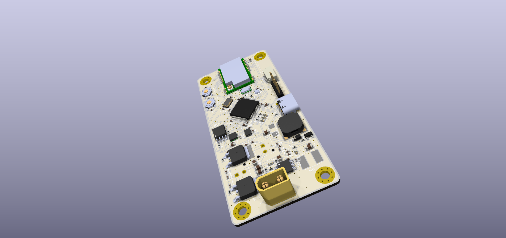

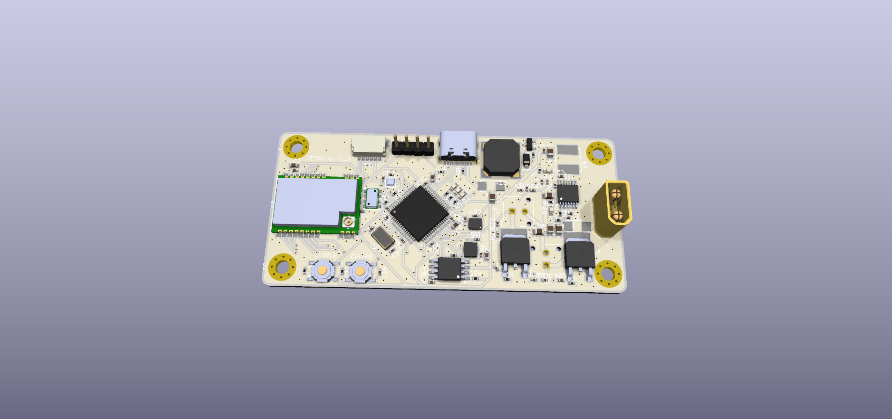

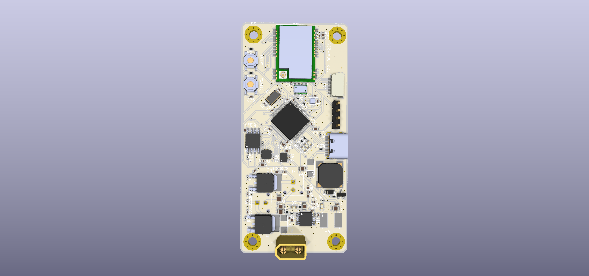

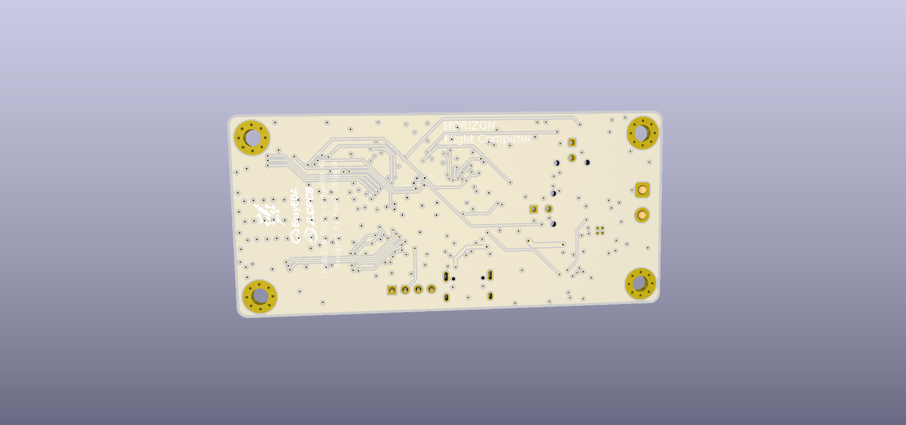

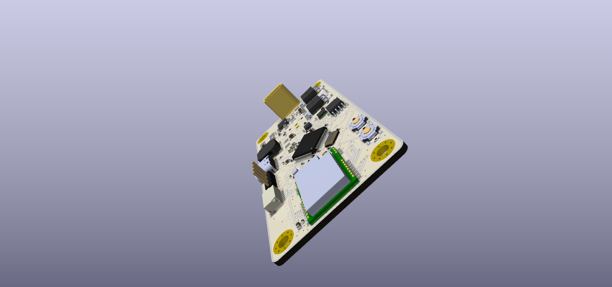

### PCB Routing
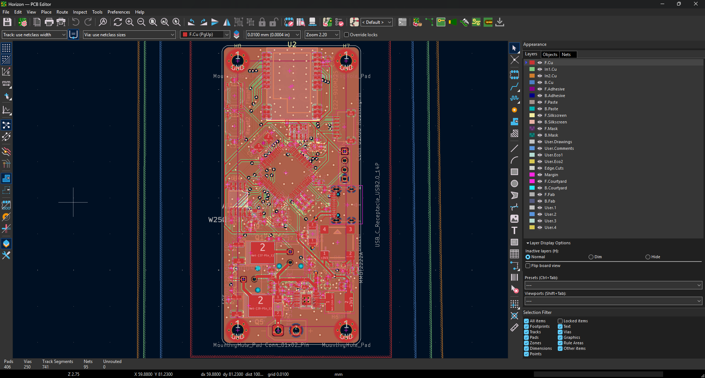

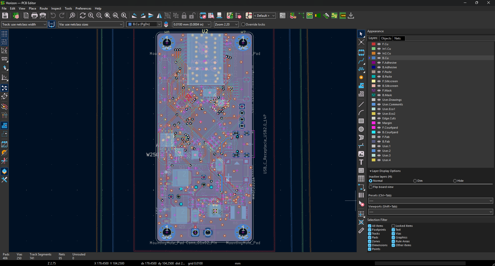

### Schematic
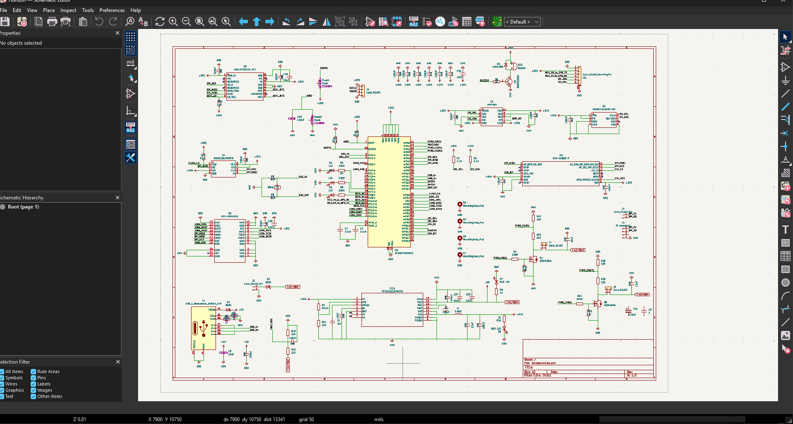

### Avionics Bay Assembly

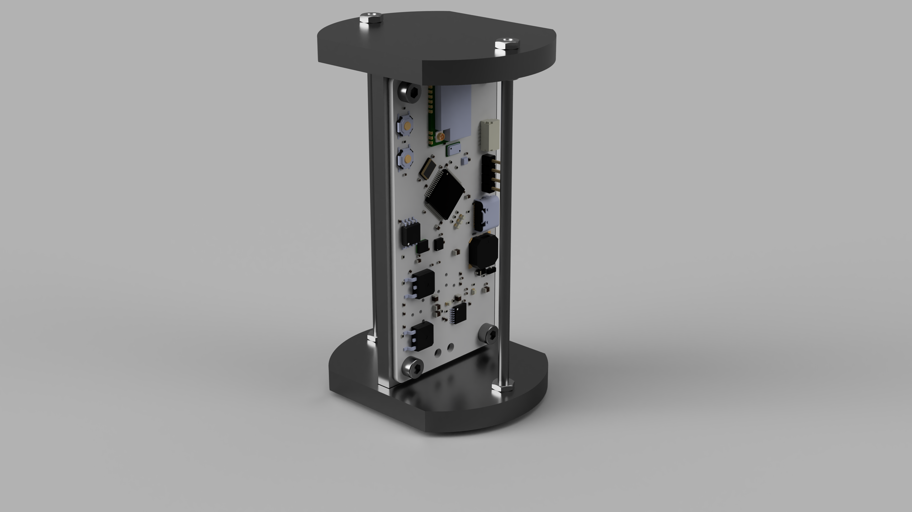

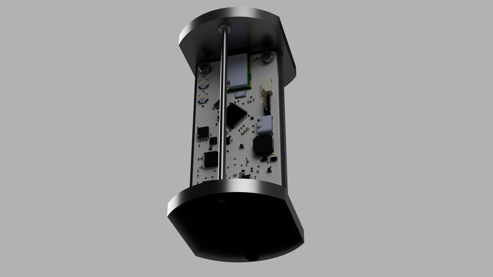

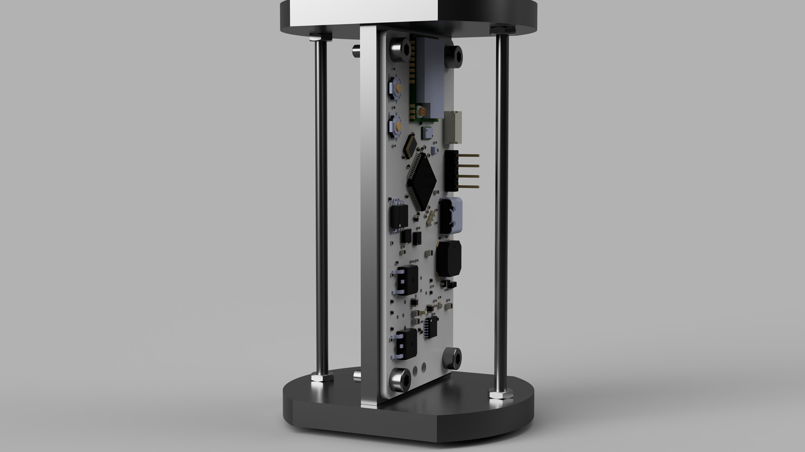

---

## Bill of Materials (BOM)

| Component | Qty | Purpose / Description | Price (USD) | Link / Distributor |
| :--- | :---: | :--- | :--- | :--- |
| **Custom PCB Manufacture** | 2 | The actual circuit board to solder everything on. Ordered via JLCPCB standard 4-layer service. | 209.53$ | [JLCPCB](https://jlcpcb.com) |
| **2S battery** | 1 | Power source / The whole pcb and pyros will get power from this. | 12.77$ | [Allegro](https://allegro.cz/produkt/akumulator-lipo-tattu-hv-550mah-2s-7-6v-xt30-dac8961b-6a7f-4425-9fd0-e271a79d3002?offerId=17837986320) |
| **HOTA D6 Pro Charger** | 1 | Dual-channel AC/DC LiPo charger for safe battery maintenance. Critical for preventing thermal runaway during 2S LiPo charging. Specifically chosen for its ability to accurately measure internal cell resistance (IR) to verify battery health for high-current pyro deployments, and its adjustable lab power supply mode for safely bringing up and testing the custom TPS step-down converters on the PCB without the risk of frying the new board. | $121.57 | [HobbyDrone.cz](https://www.hobbydrone.cz/cs/charger-hota-d6-pro-325w-15a-1-6s-dual-ac-dc/) |
| **GEPRC GEP-M1025-DQ GPS** | 1 | High-precision positioning data (u-blox M10) with integrated QMC5883L compass and backup DPS310 barometer. | $19.80 | [Banggood](https://www.banggood.com/cs/GEPRC-GEP-M1025-Series-M10-Chip-GPS-Module-for-RC-Drone-FPV-Racing-Helicopter-Quadcopter-RC-Airplane-Car-p-2000868.html?cur_warehouse=CN&ID=6324596&rmmds=search) |

### Manual Assembly Components (LCSC.com)
*Note: Due to the high complexity and cost of standard PCBA services for LGA-type sensors, these components are ordered separately and will be manually reflow soldered using a stencil and hot plate.*

| Component | Qty | Purpose / Description | Price (USD) | LCSC Part # |
| :--- | :---: | :--- | :--- | :--- |
| **ADXL372BCCZ-RL7** | 2 | High-g accelerometer (200g) for impact detection. | 35.41$ | C579465 |
| **BMP580** | 5 | Precision barometric pressure sensor. | 5.96$ | C22391138 |
| **TPS54525PWPR** | 5 | High-efficiency buck regulator. | 5.24$ | C140350 |
| **Total LCSC Cost** | - | - | **50.46$** | - |
